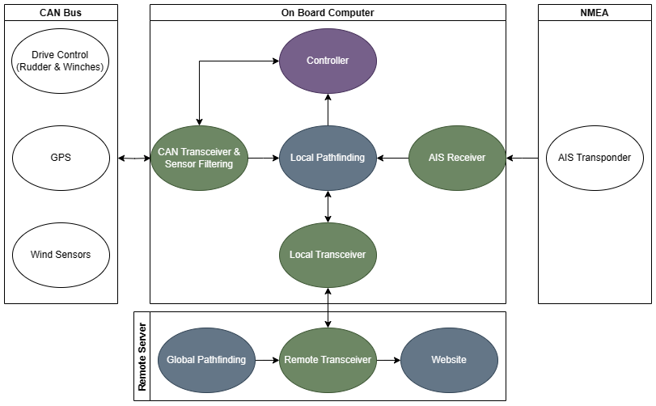
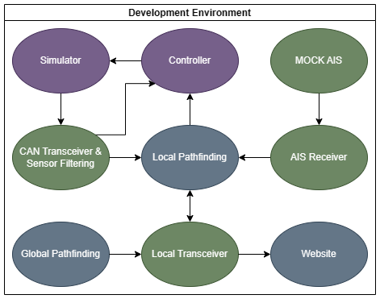

# Current Project Overview

Our current project is an autonomous research vessel capable of collecting oceanic and atmospheric data. With our
expertise in autonomous sailing, the goal is to monitor the health of our oceans while collaborating with stakeholders
and researchers involved in climate science and oceanography.

The software team is responsible for designing, implementing, and testing the software system of our autonomous sailboats.
We work on both low-level and high-level integration, from interfacing with sensors to planning sea routes with pathfinding
algorithms.

## Software Architecture

### Overview

The software architecture for our next autonomous sailboat is split across two computers: the on board computer on board
and the remote server off board. The following paragraphs will follow the flow of data between the software components on
each computer.

On the remote server, global pathfinding uses the A* pathfinding algorithm to create a sailing path, a list of global waypoints
from the current position to destination. Global sailing paths are sent via the remote transceiver to the local transceiver
on the on board computer.

On the on board computer, the CAN transceiver receives GPS and wind data from their respective sensors. This raw data is
filtered before being used in the other software components. Local pathfinding uses GPS and wind data, as well as the global
path and AIS data from the AIS receiver, to create a local path, a list of local waypoints from the current position to the
next global waypoint. The controller uses wind data and the relative bearing to the local path to adjust the rudder and
sails accordingly. The state of the boat and research data we collect is sent via the local transceiver to the remote
transceiver on the remote server.

Back on the remote server, the website presents the boat state and research data for monitoring and analysis purposes.
The remote transceiver additionally includes manual overrides such as resetting the boat state and modifying the global path.

As for the communication mediums, the computers communicate via satellite, and components on the on board computer communicate
through the Robot Operating System framework, or ROS for short.

For software development purposes, all software components will be able to run and communicate with each other locally.
To accomplish this, we will (1) create a development environment that has all software component dependencies, (2) develop
accurate simulations of the environment and hardware, and (3) add configuration options to select between real and simulated
hardware as well as running remote server components remotely or locally.

### Diagrams

In these diagrams, components of our software system are depicted as colored bubbles, with the colors denoting the software
sub-team leading its development: purple for Controls, green for Network Systems, and blue for Pathfinding. The direction
of arrows connecting the components represent the flow of data.

    
    

