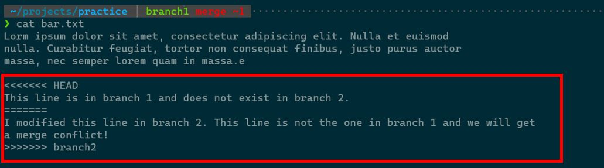

# Developing on Branches

We use branching to diverge from the main line of development and work on issues without directly
modifying the main line. This ensures that our codebase is robust and avoids merge conflicts
when multiple people are developing at the same time. For a quick rundown on branching in git,
consult the official [git documentation](https://git-scm.com/book/en/v2/Git-Branching-Branches-in-a-Nutshell).

## Creating a branch

There are three possible methods to create a branch for your next issue:

!!! caution

    When creating branches locally, it uses your **local copy** to create the new branch. Remember to do a `git pull` 
    if you intend on using the latest changes from the remote branch you are creating from.

=== "From Current Branch"

    This method creates a branch from the current branch that you are on and checks out
    to that branch automatically.

    ``` bash
    # Create new branch from current branch and checkout to the new branch
    git checkout -b <branch_name>
    ```

=== "From Specific Branch"

    This method creates a branch from a specified branch.

    ``` bash
    # Create the branch
    git branch <branch_name> <source_branch_name>

    # Checkout to the new branch
    git checkout <branch_name>
    ```

=== "From GitHub GUI"

    
    
    
    Under the `Development` section on the issue page, click `Create a branch`. Afterwards, you will see
    a prompt asking you to name your branch. 

    Once you created your branch, it will be available on the remote repository. To gain access to it
    on your local machine, do a `git pull` and checkout to that branch.

## Branch naming convention

When working on a new issue, you will want to create a branch to work on it. We have the following branch
naming convention:

```
<name>/<issue_number>-<issue_description>
```

!!! example

    If Jill is going to take on an issue titled "Fix bug on pathfinding software" and the issue number is 39, then
    the branch named can be named something like `jill/39-fix-pathfinding-bug`.

## Tracking and committing changes

All files where new changes have been made must first be "staged" in order to make commits:

```
git add <FILES>
```

Files that are staged will be part of your next commit. Once you are confident in your changes and you are ready
to finalize them, then you should commit your changes:

```
git commit -m "<commit_message>"
```

Be sure to add a commit message that is descriptive of the changes that you made. It is encouraged that you make commits
often so you can keep track of your changes more easily and avoid overwhelmingly large commits when you look back on your
version history.

When you are ready to move your local changes to a remote branch, you want to push to the correct branch
and potentially set the upstream if it does not yet exist:

```
git push -u origin <current_branch_name>
```

## Merging branches

There may be times where you want to merge two branches together, whether you diverged on some ideas and finally
want to synthesize them, or you just want to update your issue's branch with the main branch. In any case, merging
branches will be inevitable as part of the development process, so it is essential to understand how to merge branches.

=== "Merge Local Branch"

    ``` bash
    # Checkout to destination branch
    git checkout <dest_branch>

    # Merge with local copy of other branch
    git merge <other_branch>
    ```

=== "Merge Remote Branch"

    ``` bash
    # Checkout to destination branch
    git checkout <dest_branch>

    # Fetch from remote
    git fetch

    # Merge remote copy of other branch
    git merge origin/<other_branch>
    ```

!!! info

    Merging a remote branch into its local counterpart using the method above is essentially
    the same operation as `git pull`.

Once the merge operation is complete, your destination branch should have updates both from itself and the other
branch that you merge. If you do a `git log`, you will also see a new commit that indicates that the merge happened.

## Resolving merge conflicts

Merging two branches is not always easy since the commit history for both branches could look quite different, and
therefore conflicting changes can easily be made. If you run into a scenario like this, you may get something like this:


Upon inspecting `bar.txt`, we see the following:



At this point, we must resolve the conflicts before we commit our changes. The lines between `<<<<<<< HEAD` and
`=======` are the changes from `branch1`, and the lines between `=======` and `>>>>>>> branch2` are the changes
from `branch2`. Modify these lines to reflect the changes that you want, then delete `<<<<<<< HEAD`,
`=======`, and `>>>>>>> branch2`, track the conflicting file(s) with `git add`, and finally commit your changes
with `git commit`.

!!! note

    If you run into a merge conflict that you cannot resolve on your own, please reach out to a software
    lead to assist you! For more information on resolving merge conflicts, consult the official
    [git documentation](https://docs.github.com/en/pull-requests/collaborating-with-pull-requests/addressing-merge-conflicts/resolving-a-merge-conflict-using-the-command-line).

