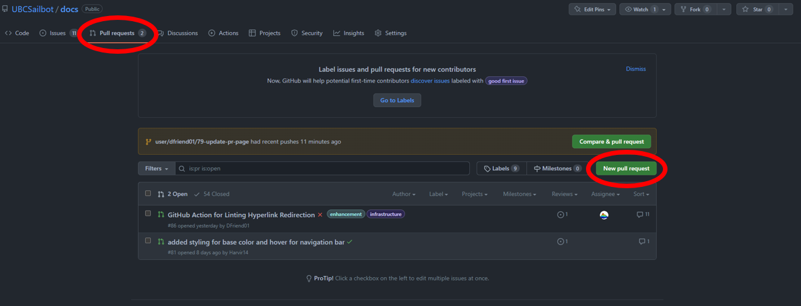

# Pull Requests

Pull requests are used to facilitate code reviews when merging a branch into the main branch. A pull request
is the implementation of an issue or other change that we want to make to the main branch.

!!! note

    Pull requests are much like issues where we can do many of the same things. This goes for creating
    comments in markdown, assigning reviewers, adding labels, adding projects, or adding milestones.
    Sometimes we skip writing an issue when the change is relatively small.

## Creating a pull request

To create a pull request in a repository, to go the `Pull requests` tab and then click `New pull request`:

On the next screen, you need to select the base branch that you are merging into, and the branch that you
are comparing. For the most part, the base branch will be the main branch, and the branch that you are comparing
will be the issue branch.

Once you have decided on your base and compare branches, click on `Create pull request`. You should see
the page below:

Notice how this is remarkably similar to the page of an issue. To link a pull request to an issue, simply add `#<ISSUE NUMBER>`
to the initial comment in the pull request.

!!! example

    "This issue resolves #49. Please review my pull request!"

Observe that the right-hand side banner contains the following:

| Field               | Description                                                                                    |
| :------------------ | :--------------------------------------------------------------------------------------------- |
| Reviewers           | Assign reviewers to review your pull request. Always try to assign at least one reviewer.      |
| Assignees           | Assign the people who worked on the issue.                                                     |
| Labels              | Assign labels to categorize pull requests.                                                     |
| Projects            | Assign a pull request to a project.                                                            |
| Milestone           | Assign a pull request to a milestone.                                                          |

!!! attention

    If you linked the pull request to an issue, you **should not** add the pull request to a project or a milestone to
    avoid duplicate cards.

## Reviewing a pull request

A common activity that you will participate in is reviewing pull requests to give your feedback on other's code.
You will be notified when you have been requested to review a pull request and should promptly review it as
soon as time permits.

In particular, you will most likely be doing the following in a pull request (both as the reviewer and the PR creator):

- **Asking Questions:** Clarify your understanding about something that you are not sure about.
- **Providing Suggestions:** Give some ideas about how to improve the current implementation and provide feedback to
your peers. This is a good opportunity to share your knowledge with others.
- **Verify Implementations:** Identify potential bugs in the implementation and raise your concerns with the person
who developed the solution. This will reduce the likelihood of bugs and significantly bring down the number of issues
in the future.
- **Documentation:** Record why certain changes were made, especially if this diverges from the proposed solution
in the linked issue (if any).

## Merging into main

Once the pull request and code reviews are complete, it is time to merge the changes in the pull request into the main
branch! However, this can only be done when the following conditions are met:

1. All CI checks pass.
2. All reviewers have reviewed the PR and approved the PR.
3. There are no unresolved comments and suggestions from the reviewers.
4. There are no merge conflicts with the main branch.

If all of these conditions are met, confirm that the merge is good to go by clicking `Squash and merge`:

