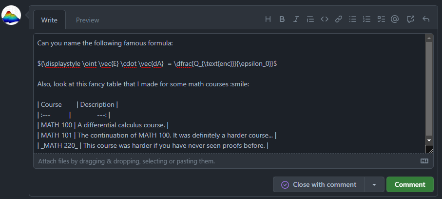
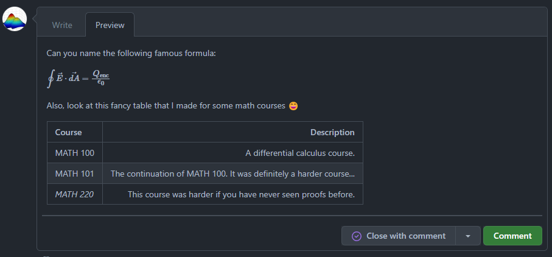

# Markdown

Markdown is a lightweight markup language that you can use to add formatting elements to plaintext text documents.[^1]
You can do anything with markdown from creating websites to PDF documents all in a clean format that is easy to
specify. [Many of your favorite services use Markdown](https://www.markdownguide.org/tools/), so it would be useful
to pick it up to create comprehensive documentation and/or messages.

Markdown is not standardized across platforms. Many services that support Markdown typically have their
own "flavour" of Markdown. Be sure to do your research on the types of features that are available for the service that
you are using Markdown with to avoid unexpected surprises with your text.

## Getting Started

We recommend [markdownguide.org](https://www.markdownguide.org/) to be your first point of reference if you are learning
Markdown for the first time. It covers topics like what Markdown is, its syntax, advanced tips, and the different
services that support Markdown. Remember to adjust to the different Markdown flavours depending on the service that you
are using!

## Sailbot and Markdown

Where do we use Markdown on Sailbot? We use it for two technologies: GitHub and Material for MkDocs. The next few
sections describe our usecases for each of these technologies.

### GitHub

We use Markdown in GitHub when use its collaboration features. This includes the following:

- README files
- Issues
- Pull Requests
- Much more

Almost anywhere in GitHub where you can write text, you can format it with Markdown. GitHub also allows you to preview
your Markdown before you submit any comments.

=== "Before Rendering"

    

=== "After Rendering"

    

The image above shows an example of a "write" and a "preview" tab for writing a comment on an issue. It might look
different depending on where you are writing, but there usually exists a preview option!

!!! note "GitHub-Flavoured Markdown"

    GitHub uses its own "flavour" of Markdown. Certain features, like using HTML, are excluded for security reasons.
    Visit the [official GitHub Markdown guide](https://docs.github.com/en/get-started/writing-on-github) for more
    information on the kinds of features available.

### Material for MkDocs

We use Markdown with Material for MkDocs to create this website! Everything that you see here has been rendered with
Markdown. This allows us to create this site without any frontend experience (although, we could spice up this site
even further with HTML/CSS)!

Material for MkDocs supports most of the common Markdown syntax. However, it also adds on to its flavour of Markdown
by adding many of its own customized features. Feel free to look at the [source code](https://github.com/UBCSailbot/docs/docs)
for this site for how our pages were generated using Material-flavoured Markdown.

!!! note "Material-Flavoured Markdown"

    Material for MkDocs' flavour of Markdown extends upon vanilla Markdown, adding features that can be used
    to take your technical documentation to the next level. Refer the the 
    [official Material for MkDocs reference page](https://squidfunk.github.io/mkdocs-material/reference/) for the kinds 
    of features available and how to render them with Markdown. 
    
    By the way, this admonition is a customized feature as part of this flavour of Markdown :wink:

[^1]: <https://www.markdownguide.org/getting-started/>
