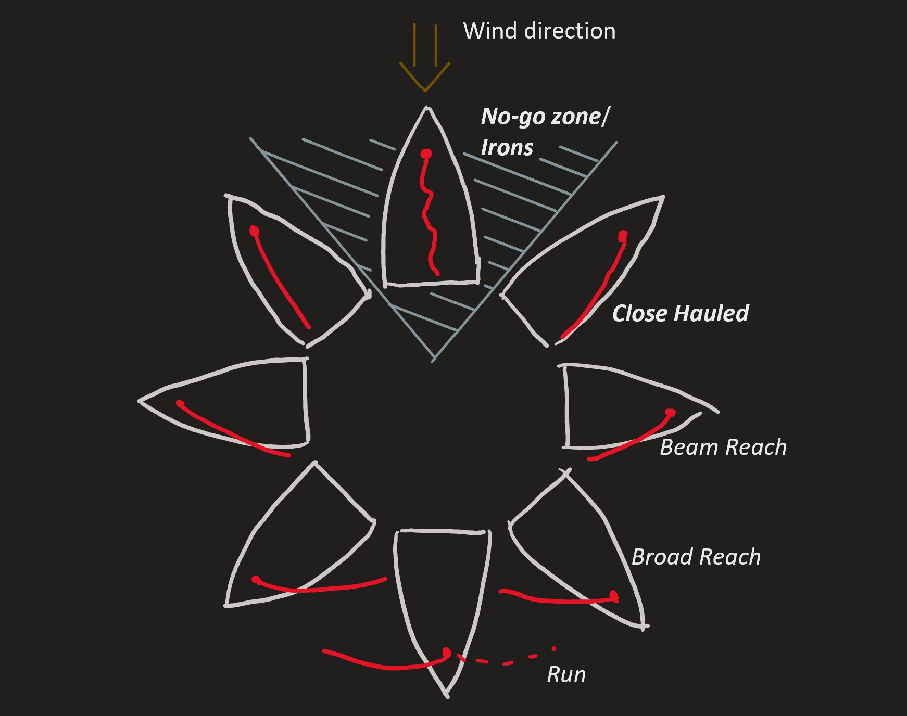
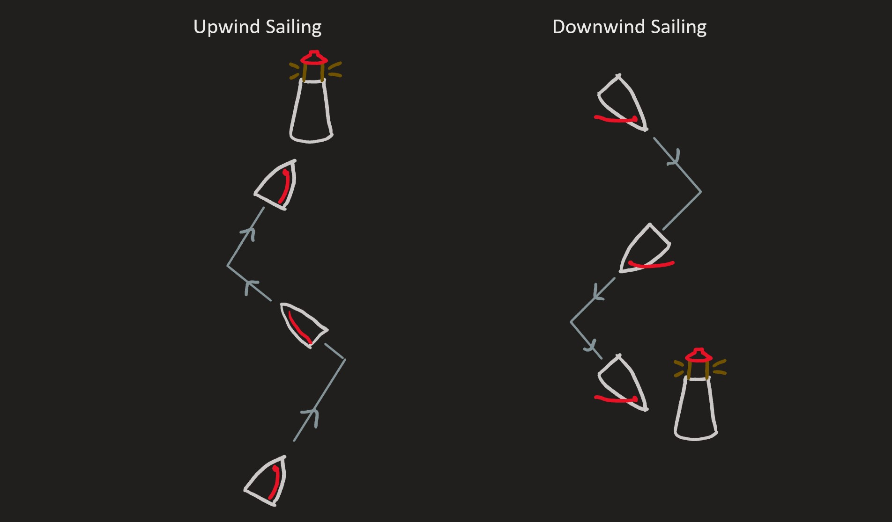

# Points of Sail

In sailing, we sometimes talk about different angles that we can sail on with respect to the wind.
Ranges of angles which are close together have special names. These ranges are called _points of sail_.
The discussion below coveres the most important points of sail for software members to understand.

Notice how for _higher_ points of sail (points of sail closer to straight into the wind), the sail is pulled tightly
in to the boat. If the boat is on a _lower_ point of sail, the sails should be let further out of the boat. For any
point of sail, there is an optimum angle that the sail should be adjusted to. If the sails are adjusted too far in
or too far out, the boat will not go as fast as it could if the sails were adjusted correctly.

## Irons

The range of angles where the boat is roughly pointing straight into the wind are called _**Irons**_, or the
_**No-Go Zone**_.
If the boat is pointing in these directions, the sails will be flapping regardless of how the sheets are adjusted.
When the sails are flapping, they are not catching the wind in a way that can propell the boat forwards.
When the boat looses propulsion, water stops flowing over the rudder, and the boat loses steering.
This is why we want our sailbots to avoid being stuck in irons.

## Upwind Sailing

If we want to sail to a destination that is not on too high or low of an angle upwind or downwind from our starting
position, we can just point our boat in that direction, adjust our sails, and go there.

However, sometimes we want to sail to a destination that is straight upwind of our starting position.
To get there, we will need to do upwind sailing.
Since we can't point our boat directly into the wind, we need to sail on an angle on the edge of irons.
We will need to tack back and forth every now and then if we want to go directly upwind.
The point of sail on the edge of Irons is called _**Close Hauled**_.

## Downwind Sailing

Raye also avoids sailing straight downwind. This means that to reach a goal downwind of the starting position,
we need to gybe back and forth in a zig-zag pattern. The point of sail straight
downwind is called a _run_, and the point of sail on the edge of a _run_ is called a _broad reach_.

